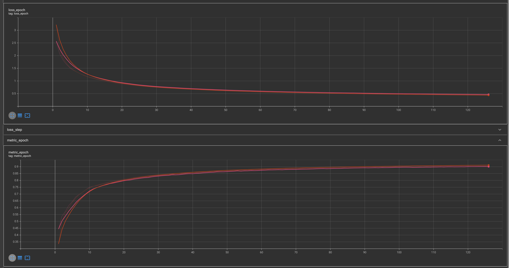

# Korean Sign Language Classification

## Dataset
[A Large-scale Korean Sign Language Datas on AIHub](https://aihub.or.kr/aihubdata/data/view.do?currMenu=115&topMenu=100&aihubDataSe=realm&dataSetSn=103)  
You can get the [sample data](./data/sample_data).
* Among a total of 4,320 morphemes in train dataset, the top 100 morphemes are selected in order of the most number of data. [ref numpy array](./EDA/top100.npy)
* Our goal is to classify the selected 100 morphemes.

## Input Data
Keypoint for human pose.
* Total 48 keypoints are used for input.  
6: shoulder, elbow, and wrist of left and right,  
42: left and right hand keypoints (21 keypoints each)
* All points are coordinated relative to the center of the body.  
The coordinates of the center of the body are defined as the average coordinates of the neck, both pelvis and shoulder keypoints. 
* After that, the min-max scaling is performed with the maximum and minimum values for each scene.

## Classification Model
LSTM classification model
* Input shape: `(batch_size, time_step(num_frame), num_keypoints(96))`
* LSTM Layer: 100 units, softmax activation
* Output shape: `(batch_size, num_class(100))`

## Training 
* loss: Categorical Crossentropy
* Metric: Categorical Accuary
* Optimizer: Adam
* epoch: 1000
* Early stop: Stop training if the validation loss does not decrease more than 10 times.

## Results (23/4/26 현황)
* Training dataset 중 8:2로 train:validation 데이터로 분할하여 학습 진행
* AIHub's Validation dataset은 test 데이터로 활용 예정
* 126 epoch 진행 중
* 최대 validation accuracy: 0.9022

## Further Plan
* 딥러닝 네트워트를 더 깊게하여 학습 진행
* 데이터 불균형에 의한 분류 편향이 확인된다면 Class weight를 적용하여 데이터 불균형 문제 해결
* 현재 추론 과정에서도 `time_step(num_frame)`이 정의되어야 하는데
실제로 application 측면에서 하나의 형태소를 나타내는 수어 동작 후 행동이 종료되었다는 Interaction 필요
따라서 time_step 없이 추론 가능한 방안 도출 필요